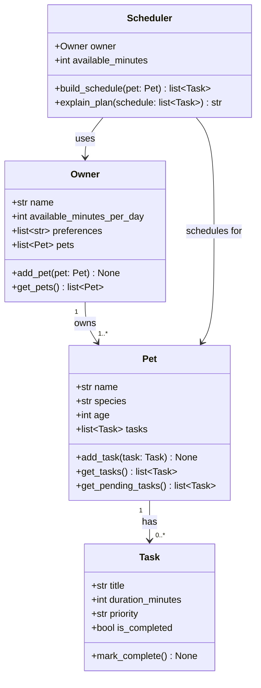

# PawPal+ Module 2 — Implementation Plan

## Status Legend
- [ ] Not started
- [x] Complete

---

## Step 1: Understand the Problem
- [x] Repo cloned and open in VS Code
- [x] Read README.md scenario
- [ ] Identify three core user actions
- [ ] Document them in reflection.md under "System Design"

**Three core actions:**
1. **Add a pet** — owner registers a pet with basic info (name, species, age)
2. **Add/manage care tasks** — owner creates tasks with title, duration, and priority
3. **Generate a daily schedule** — system produces an ordered plan of tasks based on available time and priority

---

## Step 2: List the Building Blocks

**Four main classes:**

| Class | Attributes | Methods |
|---|---|---|
| `Owner` | name, available_minutes_per_day, preferences | `add_pet()`, `get_pets()` |
| `Pet` | name, species, age, owner | `add_task()`, `get_tasks()` |
| `Task` | title, duration_minutes, priority, is_completed | `mark_complete()` |
| `Scheduler` | pet, available_minutes | `build_schedule()`, `explain_plan()` |

---

## Step 3: Draft UML with Mermaid.js

Generate a Mermaid class diagram reflecting the four classes and their relationships:
- `Owner` has one or more `Pet`s (1 to many)
- `Pet` has one or more `Task`s (1 to many)
- `Scheduler` takes an `Owner` (and their `Pet`s) as input and produces a schedule

Mermaid diagram will be embedded in plan.md and reflection.md.

---

## Step 4: Translate UML into Python Skeleton

- [ ] Create `pawpal_system.py`
- [ ] Implement `Task` as a Python dataclass
- [ ] Implement `Pet` as a Python dataclass
- [ ] Implement `Owner` as a regular class
- [ ] Implement `Scheduler` as a regular class with stub methods
- [ ] Commit: `chore: add class skeletons from UML`

---

## Step 5: Reflect and Refine

- [ ] Fill in reflection.md section "1a. Initial design"
- [ ] Review skeleton for missing relationships or logic gaps
- [ ] Document any changes in reflection.md section "1b. Design changes"

---

## Mermaid UML Diagram

